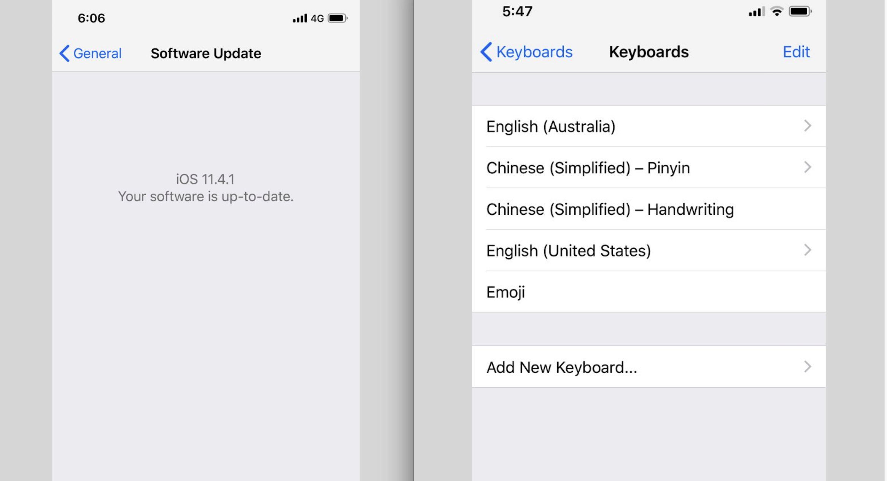

# MethodSwizzle-SafeObject-Keyboard-CFAutoreleasePoolPop-Crash
解决使用了method swizzle将NSArray和NSMutableArray的objectAtIndex:等其他类进行数据安全导致的CFAutoreleasePoolPop的崩溃问题

## 测试用例：

    1.问题 ：  
        Xcode崩溃代码：
        [UIKeyboardLayoutStar release]: message sent to deallocated instance 0x101055800
 
        崩溃日志:
         Crashed: com.apple.main-thread
        0  libobjc.A.dylib                0x187b917f4 objc_object::release() + 8
        1  libsystem_blocks.dylib         0x18801fa68 _Block_release + 160
        2  UIKit                          0x18fcd19f4 -[UIKeyboardTaskEntry dealloc] + 68
        3  libobjc.A.dylib                0x187b92134 (anonymous namespace)::AutoreleasePoolPage::pop(void*) + 836
        4  CoreFoundation                 0x188feeb28 _CFAutoreleasePoolPop + 28
        5  UIKit                          0x18f4c33e8 _prepareForCAFlush + 596
        6  UIKit                          0x18f2372f4 _afterCACommitHandler + 236
        7  CoreFoundation                 0x1890c09a8 __CFRUNLOOP_IS_CALLING_OUT_TO_AN_OBSERVER_CALLBACK_FUNCTION__ + 32
        8  CoreFoundation                 0x1890be630 __CFRunLoopDoObservers + 372
        9  CoreFoundation                 0x1890bea7c __CFRunLoopRun + 956
        10 CoreFoundation                 0x188feeda4 CFRunLoopRunSpecific + 424
        11 GraphicsServices               0x18aa59074 GSEventRunModal + 100
        12 UIKit                          0x18f2a9c9c UIApplicationMain + 208
        13 SydneyToday                    0x100116550 main (main.m:14)
        14 libdyld.dylib                  0x187ffd59c start + 4

    2.测试环境：
        * iOS 10.3.3 (iOS11以下都测出问题，包括iOS8,iOS9)
        * 项目中拖入Safe文件夹内的文件（文件使用MethodSwizzle 实现对数组、字典 等系统方法的安全校验）
        * 开启Xcode的Zombie Objects
 
    3.如何复现：
        找到能弹出键盘的界面中，键盘显示的情况下  home app 进入后台，再单击app  图标 切换回前台时 发生crash
 
    4. 处理
        Safe文件设置为挂钩NSMutableArray方法编译器标志的位置 -fno-objc-arc
 
 

## 惊喜发现
除了能导致CFAutoreleasePoolPop崩溃问题，我们发散思维想：是否也会影响键盘弹出时输入法。

前因：
    为何会想到它能影响键盘输入法?
解释：
    当然是遇到坑，而且是大坑，发现了几个月，但一直没找到解决办法
什么坑：
    个别用户手机（我们遇到的基本是iphoneX）使用我们App点击任何输入框，弹出的键盘无法输入中文，也无法切换中文，切换的小地球不见，而是一个表情按钮。但其他App正常。一开始收到这个bug，无从下手，基本想不到自己项目中哪里的问题，因为键盘是系统的，非第三方，我们代码是没办法控制系统键盘。几经周折，最后不了了之。
    

这次处理CFAutoreleasePoolPop这个崩溃问题，给问题机测试，键盘切换中文正常，欧耶！！终于处理了一个疑难杂症，一箭双雕！
    

